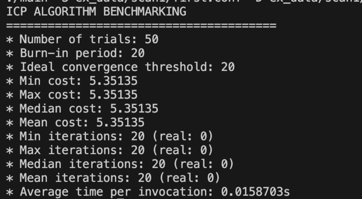
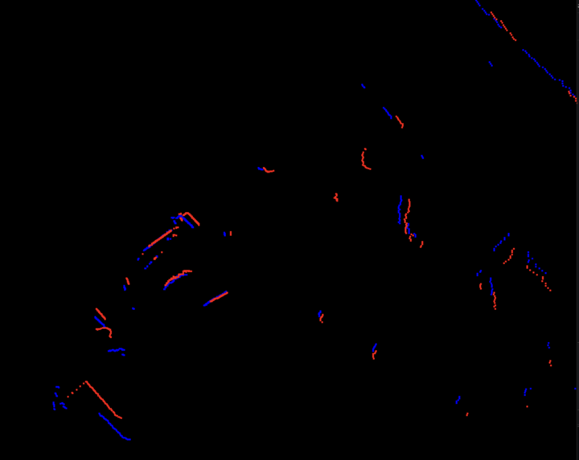

<!-- THIS FILE IS GENERATED AUTOMATICALLY. -->
<!-- DO NOT EDIT THIS FILE. -->
<!-- EDIT README.md.build INSTEAD. -->
# icp

> Last updated 2024-05-04 18:40:00.546081.  
> Made by [Ethan Uppal](https://www.ethanuppal.com).

## Introduction

This repository hosts Ethan's (my) implementation of Iterative Closest Points (ICP) as applied to scan matching.
It is a first step in my project to implement Simultaneous Localization and Mapping (SLAM).

## Install

You can view installation instructions at [INSTALL.md](INSTALL.md).

## Usage and Documentation

I host the usage information and documentation at [cornellev.github.io/icp/](https://cornellev.github.io/icp/).
Please see there for information on how to download and how to use the library.

You can build the documentation yourself locally with `make docs`.
The main page will be located at `docs/index.html` relative to the project root.

## v1.1.1 

The algorithm runs extremely fast now.
We only need it to run at 6hz with our current LiDAR.

It also matches quite well.
Below is the result of running this ICP implementation on two point clouds obtained within the workspace.

However, there is still remove for improvement with regard to outlier rejection and other parts of the algorithm (for instance, adopting a point-to-line metric).

